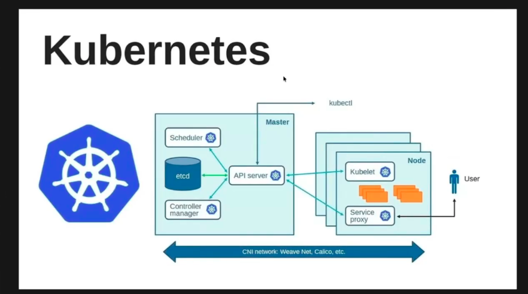
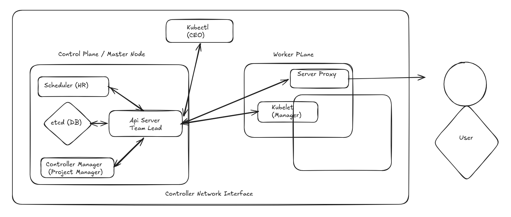

# Here we will be starting the kubernetes session today.

# History of Kubernetes.

2014 - Google Was scalling Manually.

Borg - cyborg if application becomes down so they are restarting it manuallly. 

they made a tool borg and it was doing auto scalling and auto healing.

Borg donated this tool to open source.

CNCF = Cloud native Computing foundation 

Kubernetes Helps in autoscalling and auto healing.

Here is the Architecture of Kubernetes.

collections of node is called cluster.

Gnerally there is a master node and a worker node.

Master node is one and Worker node must be multiple

control plane and worker node 

all this managed under cnf network 

