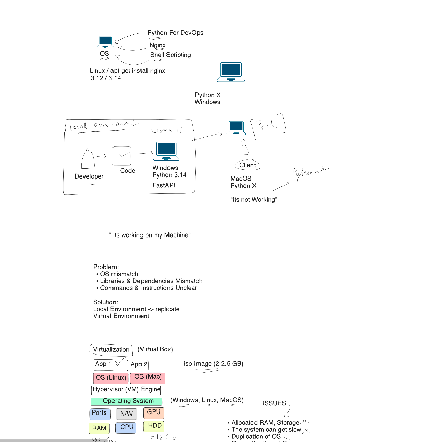
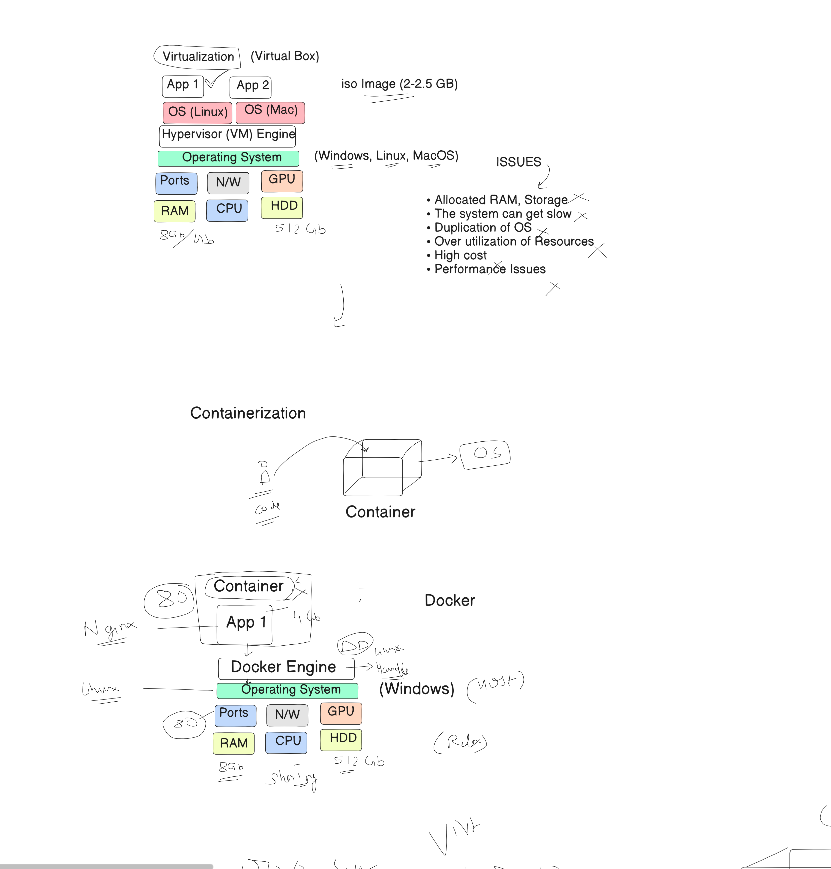

Todays Task is to Complete :
docker file and image management , multi stage docker file , docker networking , docker volume and persistance , docker compose , private registers and ci/cd integration.
Focused on virtualization and dockerization.
Today we will see Advanced topics 

- Reducing the size of Docker Image.
- My Container was crashed how do i persist mmy data 
- docker volumes 
- multitier project has frontend backend database we will be integrating everything docker compose.
- docker network and docker volume health check.

Learn today how to minimie docker file size using distroless images.

My contaier is lost how to                  
 
 we have 3 conatiner one 
  1 : frontend 
  2 : backend 
  3 : database 

now we will be mapping all the items in one using 

we will be using docker network for this 

