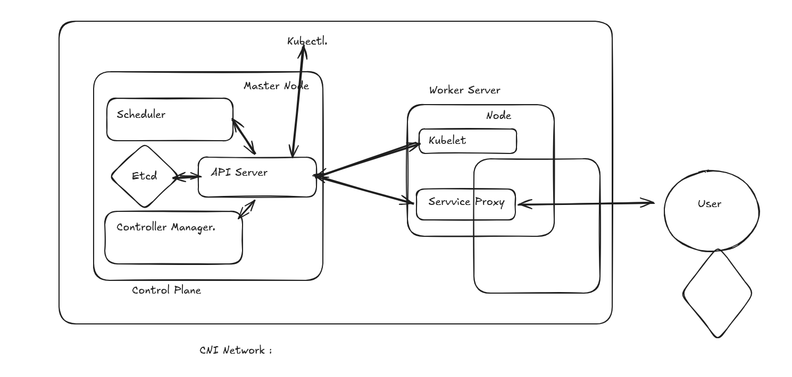

# Today we will study about K8S OR Kubernetes.

--> History

In 2014 Google was scalling Manually.
Server was scalled Manually and in case there is some isssue in server so they heal the servere Manuallly.
So they develop a technology Borg. 
Borg - Cyborg - Auto Scalling and Auto Healing.

Borg is too good.

Donated to the peoples 

Linux Foundation Came under the process.

CNCF - Cloud native computing foundation 

they chnaged the name and names it as a Kuberenetes.

Just understand he diagram frst so to understand kubernetes well

Mera app crash ho jaye uspe traffic aajaye to yeh jo kubernetes ha vo bht kaam aayega 

Kuberentes gives 2 things - Auto Scalling and Auto Healing.

this is the architecture of kubernetes.

just think like a company so here Api server is the Team Lead

scheduler is hr 
control manager is the product manger
kubectl i the ceo 
kubelet is the manger
server proxy is helps to make access of out website outside world.

Master Node has 4 component 

ETCD 
Controller Manager
Scheduler 
Api Server

Master Node is control PLane 

Worker Node :

KUbelet

Service Proxy

Head Quarter is the Control Plane 

Research and development is the Worker Node 

SErvice Proxy : Andr ki cheeze bhaar le jata ha.

API Server is the Entry point of all the commands.

ETCD = A highly available key value store holding the cluster state.

Controller  Mnager = Ensure the current state of the cluster matched the desired state.

scheduler = decide which worker node should run a newly created containe

kubelt = an agent that ensures container are running in a pod.

service procy : handles routing traffic for the node.

Container network interface (CNI)

kubelet teels all the things to Api server and then Api sever tells the scehduler ho many conatiner are more needed or not and the data is stored in the etcd database 

KUbernetes Cluster (HOw to Create)

Kubeadm [allow you to create bare metal k8s cluster]

Minikube is also used for running multiple docker conatiners i one 

KInd [ kbernetes in docker]

eks lastic kubernetes service 

aks azure kubernetes srvice 

gke google kubernetes service 

utho cloud '

killer koda

kind cluster bnana is mandatory 

so we need =
docker 
kubectl
kind for running containrs 

when yu go inside the control-plane using 

docker exec -it docker_id bash 

then when yu run the command which is top 

then yu see processes running like apiserver scheduler controller_manager kubectl so these are also docke container runnign inside a conatiner.

"Everything in kubernetes is a Mainfest File"

what is a menifest file?

@ a yaml or yml config file is a manifest file 

k8s 
# we have to study yml config very importantly because kuberentes is also based on yml config.

kubernetes padhte kaise ha 

kubernetes architecture pdh lo and then cluster bnana sikh lo 

docker file / images bnana sikh lo 

yaml/yml likhna sikh lo 
'

pod banna sikh lo 

what is a POd?

Pod is the smalllet unit in kuberentes where the application conatiner is running 

now understnd this more deeply 

kubectl says to Api server that we need a nginx server 

now api server goes to hr which is scheduler that we need a 

now scheduler asked to api server please find a space in etcd and see like in whole worker is thee is any space to ork 

api server to kubelet that hey kubelt there is a space insode yu please run this nginx server

this is how scalling works 

cntroller manager will see evet=ything is runing currectly or not 

POd = how do i make a pd 

"everything in k8s is a manifest file"

uploading  all the leaning to github for today.

Adding some more files here so that we can update the readme.md 
